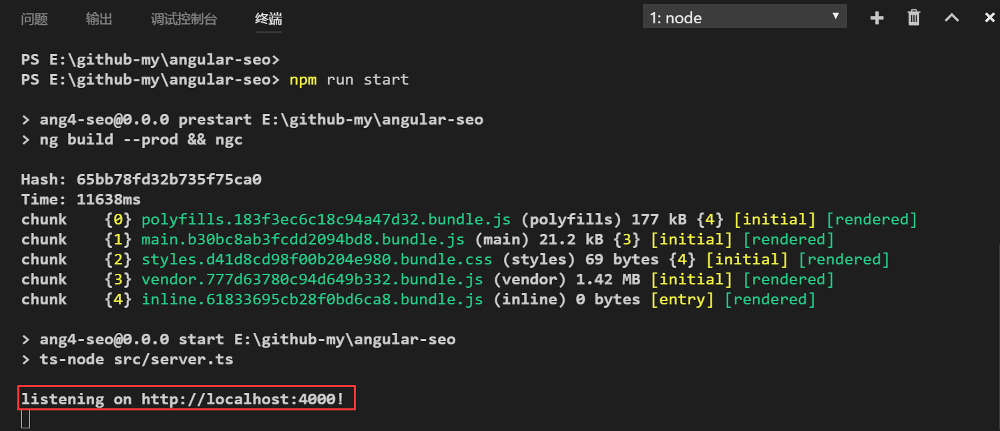

# Angular 4+ SEO Starter Template

This project is based on the [Angular SEO Tutorial](https://coursetro.com/posts/code/68/Make-your-Angular-App-SEO-Friendly-(Angular-4-+-Universal)) found at [Coursetro.com](https://coursetro.com)

Feel free to clone this repo as a quick way to get up and running with an SEO-ready, Angular CLI-ready, Angular 4+ project.

Simply clone the repo, run `npm install` in the project directory, then `npm run start`

## Note

There are some errors in the origin repo, I upgraded @angular/cli to the latest version, and modified some some configuration items to fire it up.

这个项目原来的仓库里面有一些错误，我把@angular/cli升级到了最新版本，并修改了一些配置项，现在可以顺利启动了。

看到以下界面说明启动成功：

打开你的浏览器，访问http://localhost:4000 即可。
